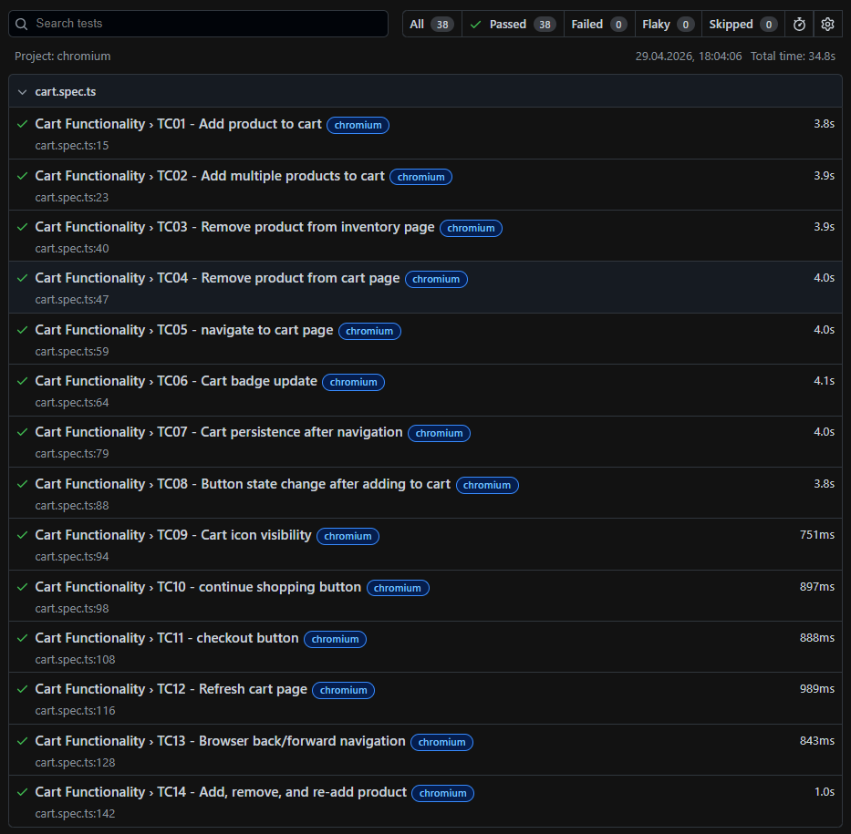
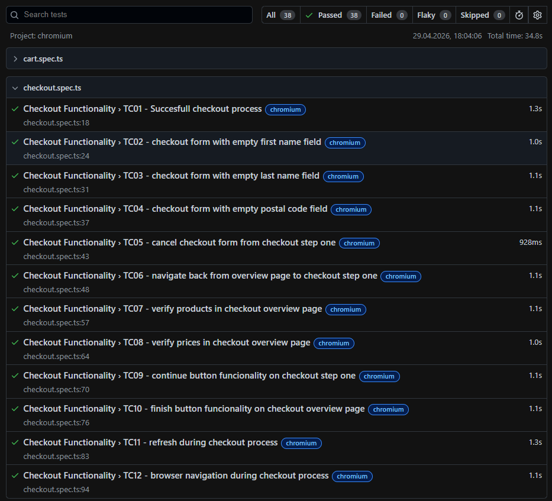
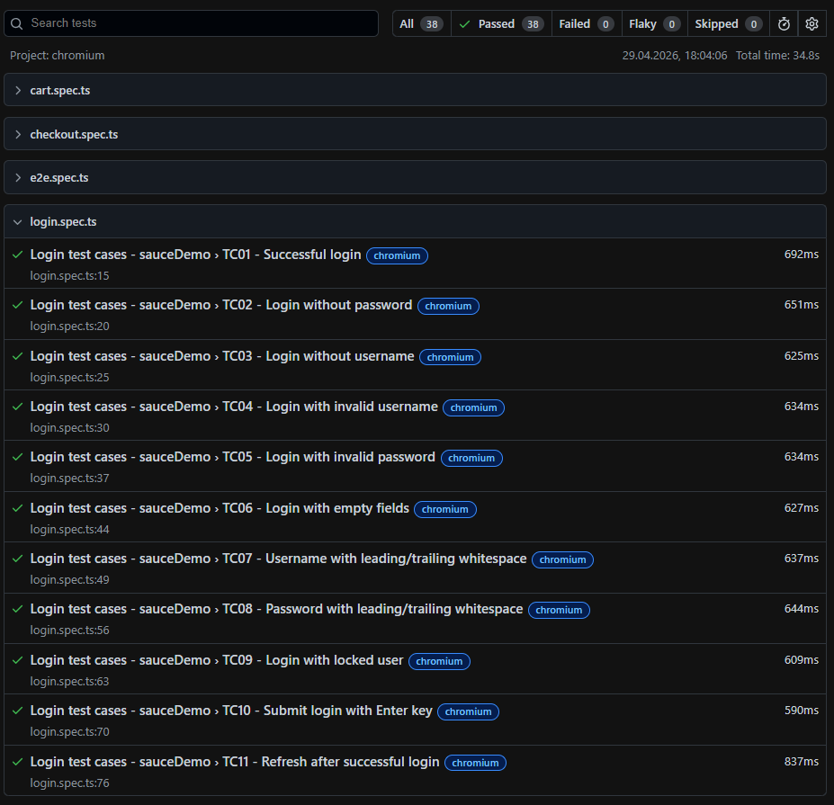
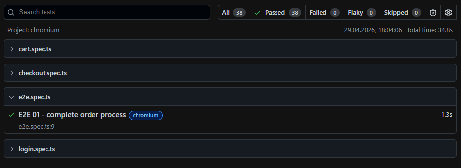
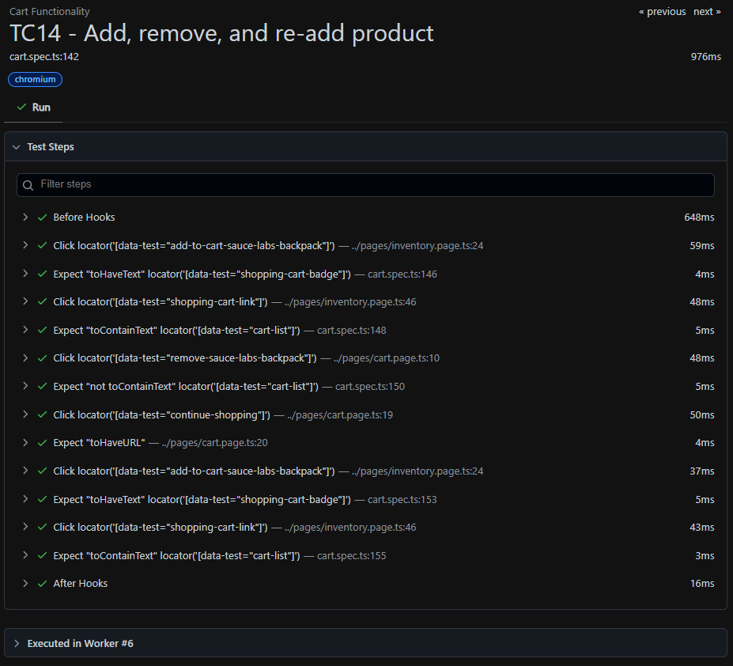
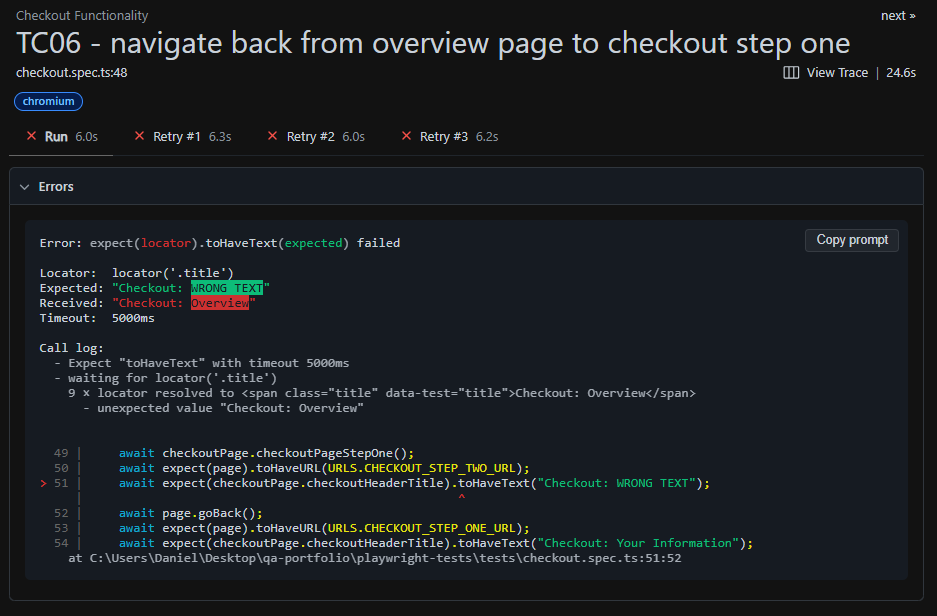
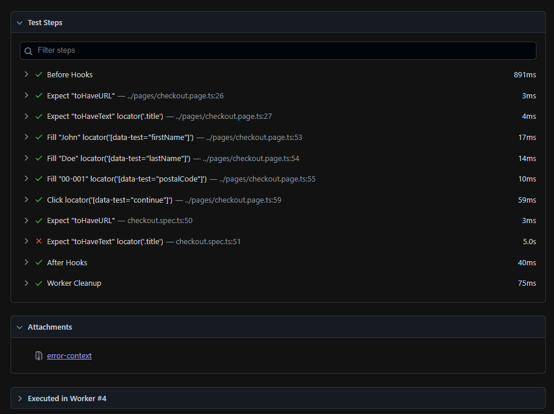

# QA Portfolio – Daniel Cendry

## 👨‍💻 About Me

Manual Tester transitioning into Test Automation (Playwright + TypeScript).
Focused on UI and API testing, as well as writing clean, maintainable test code.

---

## 🛠 Skills

* Manual Testing
* Test Design
* API Testing (REST)
* Playwright (TypeScript)
* Git / GitHub

---

## 📁 Projects

### 🔍 Manual Testing

Contains test cases, bug reports, checklists, and a test plan.
Demonstrates my approach to test design and exploratory testing.

➡️ `./manual-testing`

---

### 🤖 Playwright Tests

Automated UI and API tests built with Playwright:

* Page Object Model (POM)
* Custom fixtures
* API testing
* Mocking

➡️ `./playwright-tests`

---

### 🌐 API Testing

REST API testing project covering:

* CRUD operations
* Contract validation
* Edge cases

➡️ `./api-testing`

---

## ▶️ How to Run Playwright Tests

```bash id="runplay"
cd playwright-tests
npm install
npx playwright test
```

---

## 📊 Reports

After running tests:

```bash id="reportplay"
npx playwright show-report
```

---

## 📸 Test Execution Evidence

### 🔹 Playwright HTML Report






---

### ✅ Successful Test (Checkout Flow)



---

### ❌ Failed Test Example




---

## 🔗 Test Coverage Mapping

This table shows how different testing layers cover application features.

| Feature        | Manual Tests | UI Automation (Playwright) | API Tests |
| -------------- | ------------ | -------------------------- | --------- |
| Login          | ✔            | ✔                          | ❌         |
| Products       | ✔            | ❌                          | ✔         |
| Cart           | ✔            | ✔                          | ❌         |
| Checkout       | ✔            | ✔                          | ❌         |
| API Validation | ❌            | ✔                          | ✔         |

---

### 🧠 Notes

* ✔ = covered

* ❌ = not covered

* Manual tests define full test scenarios and edge cases

* UI automation covers critical user flows (E2E)

* API tests validate backend data and responses

* Some features are tested only on specific layers by design

## 🔍 Traceability Matrix

This table links manual test cases with automated Playwright tests.

| Test Case ID  | Feature  | Description               | Automated Test File | Status |
| ------------- | -------- | ------------------------- | ------------------- | ------ |
| LOGIN-TC01    | Login    | Successful login          | login.spec.ts       | ✔      |
| LOGIN-TC02    | Login    | Invalid login             | login.spec.ts       | ✔      |
| LOGIN-TC06    | Login    | Empty fields validation   | login.spec.ts       | ✔      |
| CART-TC01     | Cart     | Add product to cart       | cart.spec.ts        | ✔      |
| CART-TC04     | Cart     | Remove product from cart  | cart.spec.ts        | ✔      |
| E2E-TC01 | Checkout | Successful checkout (E2E) | e2e.spec.ts         | ✔      |

---

### 🧠 Notes

* Test cases use feature-based prefixes (LOGIN, CART, CHECKOUT)
* Each automated test is directly mapped to a manual test case
* Ensures clear traceability between manual and automated testing
